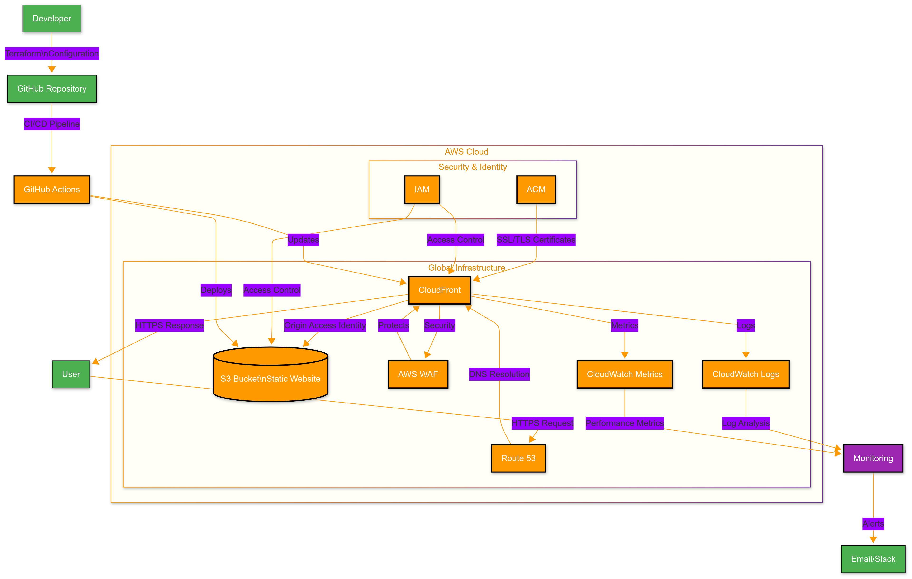

# Resume Website with AWS Infrastructure

[](https://aws.amazon.com/)
[](https://www.terraform.io/)
[](https://aws.amazon.com/s3/)
[](https://aws.amazon.com/cloudfront/)
[](https://aws.amazon.com/route53/)
[](https://aws.amazon.com/waf/)
[](https://github.com/features/actions)

## 🚀 Live Demo

Access the website using either URL:
- [https://matthewntsiful.com](https://matthewntsiful.com) (Root domain)
- [https://www.matthewntsiful.com](https://www.matthewntsiful.com) (www subdomain)

Both URLs are configured with HTTPS and will redirect to ensure a secure connection.

## Project Overview
A secure, high-performance personal resume website deployed on AWS infrastructure using S3, CloudFront, Route53, and WAF. This project demonstrates modern cloud architecture practices for hosting static websites with enterprise-grade security and performance.

## Architecture



> **Note:** This diagram was created using Draw.io. The source file is available at `diagrams/architecture.drawio`.

## Project Structure

```text
resume-webapp-terraform/
├── terraform/
│   ├── backend/              # Terraform backend configuration
│   ├── infra/                # Root module
│   └── modules/              # Reusable modules
│       ├── 00-S3-Module/     # S3 bucket and policies
│       ├── 01-Cloudfront-Module/ # CloudFront distribution
│       ├── 02-Waf-Module/    # Web Application Firewall
│       └── 03-Route53-Module/ # DNS and domain management
└── website/                 # Static website files
    └── html/
        ├── index.html
        └── error.html
```

## Security Implementation

### CloudFront Security
- **Web Application Firewall (WAF)** enabled with AWS Managed Rules
- **HTTPS Enforcement** with TLS 1.2+ required
- **Origin Access Control (OAC)** for secure S3 origin access
- **AWS Shield Standard** for DDoS protection

### S3 Security
- **Origin Access Control (OAC)** for CloudFront access
- **Block all public access** enabled
- **Server-side encryption** with Amazon S3-managed keys (SSE-S3)
- **Bucket policy** restricts access to CloudFront distribution only
- Versioning enabled for data recovery

### WAF Protection
- **Rate-based rules**: Prevents DDoS attacks
- **AWS Managed Rules**:
  - Core rule set (CRS) for common web exploits
  - Known bad inputs rule set
  - IP reputation list
  - Anonymous IP list

### IAM & Authentication
- OIDC integration with GitHub Actions
- Least privilege IAM roles
- No hardcoded credentials

## Architecture Decisions

### S3 Bucket Policies
- **CloudFront OAI**: Configured to allow access only through CloudFront using Origin Access Identity
- **Block Public Access**: Enabled to prevent accidental public exposure
- **Bucket Policy**: Restricts `s3:GetObject` to CloudFront distribution only

### CloudFront Caching
- **Static Assets**: 1-year cache TTL with versioned filenames
- **HTML Content**: 1-hour cache TTL with cache invalidation on deploy
- **Query String Forwarding**: Enabled for cache busting
- **Compression**: Gzip and Brotli enabled for all compressible content

### DNS Configuration (Route53)
- **Apex Domain**: ALIAS record pointing to CloudFront distribution
- **www Subdomain**: CNAME record to support www.matthewntsiful.com
- **SSL Certificates**: Managed by ACM with automatic renewal
- **Health Checks**: Configured for monitoring endpoint availability

### WAF Protection Rules
1. **Rate Limiting**: 2000 requests per 5-minute window per IP
2. **AWS Managed Rules**:
   - Core Rule Set (CRS) for OWASP Top 10 protection
   - Known Bad Inputs
   - IP Reputation List
   - Anonymous IP List
3. **Geo-Restriction**: Optional country-based access control
- Server-side encryption enabled for data at rest
- Bucket policies restrict access to CloudFront distribution only
- Versioning enabled for data recovery

### CloudFront Optimization
- Custom cache policies for different content types
  - Static assets (CSS/JS/images): 1-year cache TTL
  - HTML content: 1-hour cache TTL
- HTTP/2 and HTTP/3 enabled for faster loading
- Gzip and Brotli compression for text-based content
- Regional edge caches for global performance
- Custom error pages for better user experience

### DNS & Routing (Route53)
- A record for root domain pointing to CloudFront
- CNAME record for www that redirects to root domain
- DNSSEC enabled for enhanced security
- 300-second TTL for DNS records
- Alias records for better performance

### Security (WAF & Shield)
- AWS Managed Rules for OWASP Top 10 protection
- Rate limiting (1000 requests per 5 minutes per IP)
- Geographic restrictions (if applicable)
- Size constraints on requests
- Bad bot protection
- Real-time monitoring and logging

### SSL/TLS Configuration
- Free SSL certificates via AWS Certificate Manager
- Automatic renewal (managed by ACM)
- TLS 1.2/1.3 only
- HTTP to HTTPS redirect
- HSTS (HTTP Strict Transport Security) header
- Perfect Forward Secrecy enabled

### Infrastructure as Code
- Terraform modules for each AWS service
- Version-controlled configuration
- Modular design for easy updates
- State management with remote backend
- Automated testing and validation

## Core Components

- **Amazon S3**: Secure storage for static website content
- **Amazon CloudFront**: Global CDN with WAF integration
- **AWS WAF**: Protection against common web exploits
- **Route 53**: DNS and domain management
- **ACM**: Free SSL/TLS certificate management

## Key Features

- **Infrastructure as Code**: Fully automated deployment with Terraform
- **Security**: WAF protection and HTTPS enforcement
- **High Availability**: Globally distributed CDN
- **Cost-Effective**: Pay only for resources used
- **Scalable**: Handles traffic spikes with ease

## Prerequisites

- AWS Account
- Domain name (optional)
- AWS CLI configured with appropriate permissions
- Terraform (for infrastructure as code)

## Deployment

1. Clone this repository
2. Configure AWS credentials with appropriate permissions
3. Navigate to `terraform/infra`
4. Copy `terraform.tfvars.example` to `terraform.tfvars` and update values
5. Initialize and apply Terraform:

   ```bash
   cd terraform/infra
   terraform init
   terraform plan
   terraform apply
   ```

6. Deploy website content to the created S3 bucket

## Security Implementation

- **WAF Protection**:
  - SQL injection protection
  - Cross-site scripting (XSS) prevention
  - HTTP flood protection
  - Bad bot blocking
  - Request size constraints
- **Data Protection**:
  - Encryption in transit (TLS 1.2/1.3)
  - Encryption at rest (AES-256)
  - Secure headers (CSP, X-XSS-Protection)
- **Access Control**:
  - IAM roles with least privilege
  - S3 bucket policies locked down
  - No public access to origin servers
- **Monitoring & Logging**:
  - CloudFront access logs
  - WAF logs
  - S3 server access logs
  - AWS CloudTrail for API auditing

## Cost Optimization
- **S3 Costs**:
  - Pay-per-request storage class
  - Lifecycle policies for old versions
  - Intelligent-Tiering for cost savings
- **CloudFront**:
  - Pay only for data transfer
  - Edge caching reduces origin fetches
  - Free tier includes 1TB data transfer/month
- **Other Optimizations**:
  - Free SSL certificates via ACM
  - Route53 hosted zone included in free tier
  - AWS Free Tier eligible for first 12 months
  - Cost monitoring with AWS Budgets

## Module Details

### 00-S3-Module
- Creates and configures S3 bucket for website hosting
- Sets up bucket policies and access controls
- Configures versioning and logging

### 01-CloudFront-Module
- Sets up CloudFront distribution
- Configures caching behaviors
- Integrates with WAF and SSL

### 02-Waf-Module
- Implements Web Application Firewall rules
- Protects against common web exploits
- Configures rate limiting and access controls

### 03-Route53-Module
- Manages DNS records
- Handles domain verification
- Configures health checks

## Maintenance
- **Version Control**: All infrastructure code is version controlled
- **Updates**: Update variables in `terraform.tfvars` and apply changes
- **Monitoring**: CloudFront and S3 access logs enabled
- **Backup**: S3 versioning for content recovery

## Requirements
- Terraform >= 1.0
- AWS CLI configured
- AWS account with appropriate permissions
- Registered domain (optional)

## CI/CD Pipelines

### 1. Terraform CI/CD Pipeline

**Triggered when:**
- Pushes to `main`, `devops-engineers`, or `web-developers` branches
- Changes in `terraform/**` directory
- Manual trigger via GitHub Actions

**Workflow:**
1. **Plan Stage**
   - Validates Terraform configuration
   - Generates execution plan
   - Posts plan as a PR comment (for PRs)

2. **Apply Stage** (Manual approval for production)
   - Applies infrastructure changes
   - Runs `terraform apply`
   - Handles state locking

3. **Destroy Stage** (Manual trigger only)
   - Safely destroys resources when needed

### 2. Website Deployment Pipeline

**Triggered when:**
- Pushes to `main`, `devops-engineers`, or `web-developers` branches
- Changes in `website/**` directory
- Manual trigger via GitHub Actions

**Features:**
- Automated S3 deployment
- CloudFront cache invalidation
- Environment-based deployment (staging/production)
- Rollback support

### Deployment Environments

| Environment | Branch       | Auto-Deploy | Manual Approval |
|-------------|--------------|-------------|-----------------|
| Staging    | web-developers | ✅ Yes      | ❌ No           |
| Production | main         | ❌ No       | ✅ Yes          |

### Authentication
This project uses GitHub's OIDC provider to authenticate with AWS, eliminating the need for long-term access keys.

#### Required GitHub Secrets:
- `AWS_ROLE_ARN`: The ARN of the IAM role to assume
- `CLOUDFRONT_DISTRIBUTION_ID`: For cache invalidation

#### Required IAM Configuration:
1. Create an IAM Identity Provider for GitHub Actions
2. Configure the IAM role with a trust policy for GitHub's OIDC provider
3. Attach necessary permissions to the IAM role

## Deliverables Status

### Infrastructure
- [x] Terraform configuration for all AWS resources
- [x] Multi-environment support (staging/production)
- [x] Secure S3 bucket configuration
- [x] CloudFront distribution with WAF
- [x] Route53 DNS configuration
- [x] Automated SSL certificate management

### CI/CD Pipeline
- [x] GitHub Actions workflow for infrastructure
- [x] GitHub Actions workflow for website deployment
- [x] OIDC authentication for AWS
- [x] Automated testing and validation
- [x] Deployment approval gates for production

### Security
- [x] WAF rules for OWASP Top 10 protection
- [x] Rate limiting and DDoS protection
- [x] Secure IAM roles with least privilege
- [x] No hardcoded credentials
- [x] Infrastructure as Code best practices

### Documentation
- [x] Architecture diagram
- [x] Setup and deployment instructions
- [x] Security considerations
- [x] Troubleshooting guide
- [ ] Performance benchmarks

## License
[Your License Here]

## Contact
[Your Contact Information]